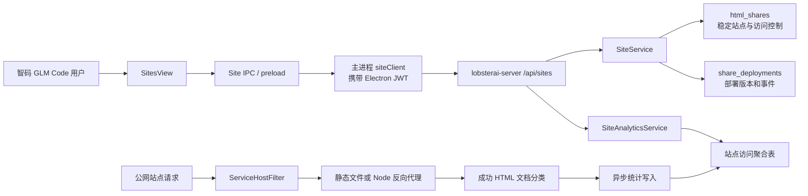

# 站点管理与访问分析功能设计文档

> 创建日期：2026-07-21
> 状态：待评审
> 涉及仓库：`智码 GLM Code`、`lobsterai-server`
> 产品入口：智码 GLM Code 左侧栏「站点」

## 1. 概述

### 1.1 背景

智码 GLM Code 已经能够从 Artifact 面板把本地服务部署为动态 Node 服务或静态站点，也已有分享访问控制、服务状态、治理和基础访问统计能力。但是这些面向普通用户的能力分散在 Artifact 分享弹窗中，缺少一个统一入口来回答以下问题：

1. 我部署过哪些站点？
2. 站点当前能否访问，部署是否正常？
3. 站点是公开访问还是分享码访问？
4. 如何停止或恢复访问？
5. 最近有多少页面浏览量（PV）和独立访客（UV）？哪些页面最热门？
6. 当前套餐还能同时上线多少个站点，达到上限后如何安全腾出名额？

本功能在 智码 GLM Code 左侧栏增加「站点」入口，提供空态创建引导、站点列表、站点详情、访问设置和访问分析。整体交互参考需求附图，但视觉实现必须沿用当前 智码 GLM Code 的管理页框架、主题变量、侧栏折叠行为和中英文国际化体系。

### 1.2 代码与测试库现状核对

本设计基于 2026-07-21 对客户端、服务端两个仓库和测试库的只读核对，而不是只依据旧文档。

| 能力              | 当前状态                                                                       | 结论                                |
| ----------------- | ------------------------------------------------------------------------------ | ----------------------------------- |
| 动态服务部署      | `POST /api/share-deployments/node` 已实现                                      | 直接复用                            |
| 静态站点部署      | `POST /api/share-deployments/static` 已实现                                    | 直接复用                            |
| 用户分享列表      | `GET /api/html-shares/my` 已实现，但混合所有 Artifact 分享，且不含完整部署状态 | 不适合作为站点页直接数据源          |
| 用户访问方式修改  | `PUT /api/html-shares/{shareId}/access-mode` 已实现                            | 由站点 API 门面复用                 |
| 用户停止/恢复访问 | `PATCH /api/html-shares/{shareId}/status` 已实现                               | 由站点 API 门面复用，并补齐状态语义 |
| 用户部署详情      | `GET /api/html-shares/{shareId}/deployment` 已实现                             | 可复用，站点详情接口统一聚合        |
| 部署数量限制      | Node 另有全局默认 3；通用 HTML 分享还有默认 10，二者都可能自动停止较早记录     | 站点必须拆出并替换为套餐统一额度    |
| 用户访问分析      | 尚无所有者可调用的统计接口                                                     | 新增                                |
| 热门页面          | 当前没有页面路径维度                                                           | 新增                                |
| 跨日精确 UV       | 当前只能按日记录独立 IP，不能把每日 UV 相加作为区间 UV                         | 新增访客维度聚合                    |

测试库相关表已存在且有数据，`information_schema` 的近似行数如下：

| 表                                  | 近似行数 | 作用                        |
| ----------------------------------- | -------: | --------------------------- |
| `html_shares`                       |      133 | 稳定分享/站点标识与访问控制 |
| `share_deployments`                 |      105 | 部署实例和版本              |
| `share_deployment_events`           |      270 | 部署事件                    |
| `html_share_access_stats`           |      104 | 当前内容版本的每日访问聚合  |
| `html_share_ip_access_stats`        |      176 | 当前内容版本的每日 IP 聚合  |
| `html_share_access_dimension_stats` |      299 | Referer、UA 等维度          |

测试库没有 `flyway_schema_history` 表。当前仓库虽使用 `sql/Vxx__*.sql` 命名，但上线方案不能假设 Flyway 会自动执行迁移，必须纳入 DBA/发布平台实际 SQL 执行与 `information_schema` 验证步骤。本文档不记录测试库账号或密码。

### 1.3 核心模型决策

站点和部署必须分层建模：

| 概念               | 稳定标识        | 当前数据来源        | 生命周期                                                       |
| ------------------ | --------------- | ------------------- | -------------------------------------------------------------- |
| 站点（Site）       | `share_id`      | `html_shares`       | 公网地址和用户认知中的长期资源，重新部署后保持不变             |
| 部署（Deployment） | `deployment_id` | `share_deployments` | 一次静态发布或动态云运行实例，可失败、停止、过期或被新版本替换 |

首期不新增 `sites` 主表。`html_shares` 中以下两类记录即为站点：

```text
node_service_deployment
static_service_deployment
```

HTML、图片、SVG、Markdown、Mermaid、Office/PDF 等普通 Artifact 分享不进入「站点」列表。站点 API 使用聚合门面统一查询 `html_shares` 和最新部署记录，避免 Electron 客户端理解底层表结构。

### 1.4 目标

1. 在 智码 GLM Code 左侧栏提供稳定的「站点」入口。
2. 展示当前用户的动态服务和静态站点，每个站点只显示一条，不把历史部署版本重复列出。
3. 清晰区分访问状态、部署状态和访问方式。
4. 支持修改站点名称、访问方式、停止/恢复访问，以及在停止后永久删除站点。
5. 提供最近 7/30 天的 PV、UV、每日趋势及热门页面。
6. 空态提供「新建站点」和模板卡片，点击后创建新任务并把对应提示词填入对话框。
7. 复用现有鉴权、订阅、分享码、内容审核、部署和治理能力，不修改管理员后台。
8. 不让统计写入失败影响公网站点访问。
9. 按订阅套餐限制同时在线站点数量；超额时不自动停止任何既有站点，由用户在部署入口明确选择并确认停止后继续。

### 1.5 非目标

| 非目标                       | 说明                                                                                                     |
| ---------------------------- | -------------------------------------------------------------------------------------------------------- |
| 从站点页直接上传任意本地目录 | 首期仍由 Cowork 任务生成/运行服务，再从 Artifact 分享部署                                                |
| 在线编辑源码或运行命令       | 构建命令、启动命令、端口、持久化绑定只能通过重新部署修改                                                 |
| 自定义域名                   | 后续独立设计证书、DNS 校验和域名归属                                                                     |
| 部署版本回滚                 | 保留历史记录，但不在首期开放回滚                                                                         |
| 完整商业网站分析平台         | 首期不做地域、设备、转化漏斗、实时在线人数和事件埋点                                                     |
| SPA 客户端路由埋点           | 首期统计服务端实际收到并成功返回 HTML 的文档请求；纯前端路由切换不额外计 PV                              |
| 私有成员/组织 ACL            | 首期仍为公开访问或分享码访问                                                                             |
| 自动生成站点截图             | 首期所有站点统一使用默认服务图标，不根据站点名称、类型或 `siteId` 生成不同占位图；后续再评估安全截图服务 |
| 管理员后台改造               | 当前版本不修改 `lobsterai-admin`，也不新增管理员站点分析页面或接口                                       |

## 2. 用户与产品场景

### 场景 1：首次进入站点页

**Given** 用户已登录，但从未部署动态服务或静态站点。
**When** 用户点击左侧栏「站点」。
**Then** 页面展示空态、主按钮「新建站点」和个人简历、店铺主页、活动邀请函、调查问卷四个模板，不展示空列表框架。

### 场景 2：通过模板创建任务

**Given** 用户在站点空态或页面头部。
**When** 用户点击「活动邀请函」。
**Then** 智码 GLM Code 创建一个新 Cowork 任务，切回对话页，将本地化后的活动邀请函建站提示词填入输入框并聚焦；不自动发送消息。

### 场景 3：查看所有站点与状态

**Given** 用户部署过多个站点，其中包含在线、部署中、部署失败和已停止状态。
**When** 用户进入站点页。
**Then** 每个稳定 `share_id` 只显示一行，显示名称、URL、站点类型、访问方式、访问状态、部署状态、最近更新时间和主要操作。

### 场景 4：切换访问方式

**Given** 站点处于允许用户修改的状态。
**When** 用户把访问方式从「公开访问」改成「分享码访问」。
**Then** 服务端复用现有分享码能力，返回可复制的分享码；原站点 URL 和部署不变。

### 场景 5：停止动态服务访问

**Given** Node 动态服务当前在线。
**When** 用户确认「停止访问」。
**Then** 公网访问立即关闭，服务端清理动态云资源，站点保留在列表中，历史分析保留；页面明确标记「恢复需要重新部署」。

### 场景 6：停止并恢复静态站点

**Given** 静态站点当前在线。
**When** 用户停止访问后再次点击「恢复访问」。
**Then** 服务端重新打开分享状态，原 URL 和静态文件不变，无需重新构建。

### 场景 7：查看分析

**Given** 站点在过去 30 天有访问。
**When** 用户打开「分析」并选择过去 30 天。
**Then** 页面展示区间 PV、区间 UV、按日趋势和热门页面；无访问日期补 0，区间 UV 不通过每日 UV 相加计算。

### 场景 8：无订阅用户管理既有站点

**Given** 用户订阅已失效，但仍有历史站点。
**When** 用户进入站点页。
**Then** 仍可查看列表、详情和统计，也可停止访问；创建、恢复、改访问方式、重命名等增加或继续提供公网能力的操作按现有订阅策略拦截并展示订阅引导。

### 场景 9：部署时达到套餐在线站点上限

**Given** 用户拥有有效订阅，准备从 Artifact/本地服务预览卡片部署新站点，但当前已占用套餐全部在线站点名额。
**When** 用户点击「部署」。
**Then** 客户端不上传构建产物、不创建新部署，改为展示「在线站点已达上限」弹窗，显示当前套餐、`已使用/上限` 和可停止的在线站点；用户选择一个站点并完成二次确认后，客户端先停止该站点，再重新校验配额，校验通过才恢复原部署流程。用户取消、停止失败或二次校验仍超额时均不得部署，也不得由服务端自动选择并停止旧站点。

### 场景 10：永久删除已停止站点

**Given** 用户已经停止站点访问，Node 动态服务也已完成云资源释放。
**When** 用户在设置页点击「删除站点」、阅读不可恢复提示并完整输入当前站点名称。
**Then** 服务端永久关闭原地址，删除页面文件、访问凭证、访问分析和持久化服务数据，站点立即从用户列表隐藏；保留不可恢复、不可重新分配的最小墓碑和内部部署审计记录。重复删除请求幂等成功。在线、部署中或仍有活动云资源的站点必须先停止，不能直接删除。

## 3. 功能边界与术语

### 3.1 指标定义

| 指标             | 首期定义                                          |
| ---------------- | ------------------------------------------------- |
| PV（页面浏览量） | 站点服务端成功返回 HTML 文档的一次有效 `GET` 请求 |
| UV（独立访客）   | 日期范围内按站点访客 Cookie 识别的不同访客数量    |
| 每日 UV          | 当天不同访客数量                                  |
| 热门页面         | 日期范围内按规范化 URL path 聚合的 PV 和 UV       |
| 站点生命周期统计 | 同一 `share_id` 下跨多次重新部署累计的统计        |

以下请求不计入产品分析：

- JS、CSS、图片、字体、接口和其他非 HTML 资源请求；
- 分享码输入页和验证接口；
- 管理员预览；
- 健康检查和 智码 GLM Code 内部路径；
- `HEAD`、写请求和失败响应；
- 已识别的搜索引擎/监控机器人；
- 站点关闭页、部署中页、失败页等平台状态页。

### 3.2 访问状态与部署状态不是一回事

| 状态维度 | 来源                                      | 示例                                                   |
| -------- | ----------------------------------------- | ------------------------------------------------------ |
| 访问状态 | `html_shares.status` 与 `disabled_source` | 可访问、用户停止、管理员停止、审核拦截、额度停止       |
| 部署状态 | 最新 `share_deployments.status`           | 排队中、构建中、部署中、在线、部署失败、已停止、已过期 |
| 访问方式 | `html_shares.access_mode`                 | 公开访问、分享码访问                                   |

UI 不得只展示一个模糊的「状态」。列表可以提供一个综合主状态，但详情必须同时展示访问状态和部署状态。

### 3.3 订阅在线站点配额

最终方案按“同时占用的站点名额”限制部署，不区分动态服务和静态站点。服务端以订阅关联的 `plans.name` 选择 `site.quota.plan-limits.*` 配置，不使用可能因环境不同而变化的数字 `plan_id`。各环境可以独立覆盖额度，生产默认值如下：

| 套餐 `plans.name` | 中文名 | 同时在线站点上限 |
| ----------------- | ------ | ---------------: |
| `standard`        | 标准   |                5 |
| `advanced`        | 进阶   |               15 |
| `professional`    | 专业   |               40 |
| `elite`           | 卓越   |              100 |

#### 最终限制规则摘要

1. 产品层只有上表这一套站点数量限制：Node 动态服务和静态站点进入同一个额度池，不再分别设置数量；
2. 删除“单用户最多 3 个火山云函数”的独立限制和超额后自动停止旧函数的逻辑；动态服务数量只受套餐统一站点额度约束；
3. 静态站点虽然不创建火山云函数，仍占用 1 个站点名额。例如标准套餐拥有 3 个 Node 服务和 2 个静态站点时即达到 5 个上限；
4. 火山云账号/区域自身的基础设施硬容量仍由运维监控，但它不是用户套餐规则。云厂商容量不足时本次部署返回明确失败，绝不能通过自动停止该用户或其他用户的既有服务来腾容量；
5. 普通 HTML、图片、文档等 Artifact 分享不属于站点额度，也不能触发站点自动关闭；其原有分享限制与站点额度彼此独立；
6. 达到上限时只阻止需要新增名额的操作，并在预览卡片部署入口引导用户选择、二次确认停止现有站点；服务端不替用户选择；
7. 额度是并发安全的服务端强约束。客户端预检用于及时展示弹窗，最终仍由 reservation 和创建事务校验，旧客户端也不能绕过。

计数单位是稳定站点 `share_id`，不是部署记录数：

- 同一站点重新部署产生多个 `deployment_id`，仍只占 1 个名额；
- 公开访问和分享码访问均占 1 个名额；
- 静态站点与 Node 动态服务使用同一额度池；
- 新建站点从排队/部署中开始占用名额，防止并发提交绕过限制；
- 可访问的在线站点占用名额；用户停止、部署失败、已停止、已过期以及管理员/审核已关闭且不可访问的站点不占名额；
- Node 云资源清理失败不应重新开放站点；配额可按访问已关闭释放，但服务端必须进入清理重试和告警，避免资源泄漏；
- 正在在线运行的同一 `share_id` 原地重新部署不增加名额，即使用户因降级处于整体超额状态也允许更新该站点；已停止站点重新部署或静态站点恢复访问会重新占用名额，必须重新校验。

无有效订阅、订阅过期和 `free` 套餐保持现有“不可创建新部署”策略，本次不额外赠送站点名额。升级后新额度立即生效；降级后不自动关闭既有站点，只将账号标记为超额并阻止新建、恢复以及已停止站点重新部署，直到用户主动把占用量降到新上限以内。

## 4. 产品交互设计

### 4.1 左侧栏入口

在 `技能`、`MCP` 等固定功能入口区域新增「站点」，建议放在 `MCP` 之后，避免插入会话树区域。

要求：

- 图标使用现有 16px 线性图标风格；
- 当前页使用与其他固定入口一致的 active 样式；
- 上报 `sidebar_action/open_sites`；
- 打开站点页时关闭搜索弹窗；
- 跟随 macOS、Windows 和侧栏折叠逻辑；
- 支持企业配置 `ui.sites = hide | disable | readonly`；
- 所有可见文案在 `src/renderer/services/i18n.ts` 同时提供 `zh`、`en`。

`App.tsx` 的主视图类型从：

```typescript
'cowork' | 'skills' | 'scheduledTasks' | 'kits' | 'mcp';
```

扩展为包含：

```typescript
'sites';
```

### 4.2 未登录状态

站点数据必须通过当前 Electron JWT 获取。未登录时不发站点列表请求，仅展示登录说明，不在站点页重复提供登录按钮；用户可通过应用已有登录入口完成登录。登录完成后重新进入或当前页收到 auth 状态变化时加载数据。

### 4.3 空状态

空状态布局参考需求图：

1. 标题「站点」；
2. 副标题「将你的想法一键部署成真实网站」；
3. 右上角主按钮「新建站点」；
4. 居中空态说明「暂无站点」；
5. 四个模板卡片：
   - 个人简历：在线简历与作品集页面；
   - 店铺主页：小型商铺或工作室展示页；
   - 活动邀请函：聚会、婚礼或活动的在线邀请页；
   - 调查问卷：在线表单与问卷收集页。

点击主按钮使用通用建站提示词；点击模板使用模板专属提示词。交互只填充输入框，不自动发送，用户仍有机会补充需求。

### 4.4 有数据列表

页面顶部复用「技能」页的管理页面结构：最上方为 48px 高、带底部分隔线的独立标题栏，仅展示「站点」和侧栏折叠控制；标题栏空白区域使用 Electron `drag` 区域支持拖动窗口，侧栏按钮、更新提示和其他交互控件必须使用 `no-drag`。macOS 侧栏折叠时为系统交通灯保留左侧间距，Windows 行为与技能页保持一致。

标题栏下方保持简约，只展示副标题「管理部署的服务」和一行紧凑工具栏；有数据时搜索、状态筛选、刷新和「＋ 新建」位于同一行，搜索、筛选和刷新高度统一为 36px，「＋ 新建」使用 32px 高、14px 图标、10px 横向内边距且不带阴影的紧凑主按钮，减少视觉重量；空状态下仍在副标题右侧保留完整的「＋ 新建站点」。不增加「发布与托管」等上级标签，也不在副标题重复罗列访问方式和站点表现。内容宽度、左右留白和滚动行为参考「技能」页。列表、详情、弹窗、按钮、输入框和分析图表统一使用客户端现有主题 token，跟随浅色、深色和用户选择的主题色，不硬编码固定蓝色主按钮或固定浅色卡片。列表上方提供：

- 关键字搜索：匹配站点名称、URL、`share_id`；
- 综合状态筛选：全部、在线、不可访问；「不可访问」由服务端聚合停止访问、受限、需要重新部署和部署失败，部署中的站点不归入该筛选；
- 首期不单独提供访问方式和站点类型筛选，避免工具栏选项过多；访问方式和站点类型继续在列表项中展示。

每行信息：

| 区域   | 内容                                                                            |
| ------ | ------------------------------------------------------------------------------- |
| 预览   | 首期所有站点统一显示默认服务图标，不远程抓取站点截图                            |
| 主信息 | 站点名称、URL，长文本省略并支持复制                                             |
| 状态   | 综合状态徽标，同时显示访问方式                                                  |
| 时间   | 最近部署/更新时间，鼠标悬停显示完整时间                                         |
| 主操作 | 点击站点行进入分析页                                                            |
| 次操作 | 右侧低权重 `…` 菜单提供「查看分析」「站点设置」；不在站点列表提供部署或重新部署 |

每行不重复平铺多个文字按钮。`…` 默认低透明度，行悬停、键盘聚焦或菜单展开时增强显示；菜单支持点击外部、滚动窗口和 `Esc` 关闭。菜单操作必须阻止站点行点击事件，键盘在站点行按 Enter/Space 进入分析，在菜单按钮上操作时不得误触发行跳转。

默认按最近更新时间倒序，每页固定显示 10 条；结果超过 10 条时显示分页，支持上一页、下一页和当前页/总页数提示。搜索输入使用 300ms 防抖；切换搜索条件或筛选条件后回到第 1 页。翻页和筛选由服务端完成，禁止拉取所有分享后在前端过滤。

#### 默认服务图标规则

1. 默认图采用统一的浏览器卡片容器，中心使用参考客户端官方 Logo 轮廓绘制的单色龙虾线性图形；去掉官方应用图标自带的红色方形背景，图形颜色跟随当前主题主色，不再使用容易被误认为蜜蜂的橙蓝组合；
2. 所有站点复用同一组件和同一套视觉资源，不截取站点名称前两个字符，也不根据站点名称、`siteId`、站点类型生成随机或不同配色；
3. 动态服务和静态站点的差异通过类型文字、状态徽标和详情字段表达，不通过默认图变体表达；
4. 首期客户端不请求缩略图 URL，服务端站点列表和详情接口不新增缩略图字段；
5. 默认图仅作视觉占位，不应被用户理解为站点首页截图；官方图形以小尺寸展示且不附带品牌文字，避免抢占站点内容层级；图标本身对辅助技术隐藏，由站点名称提供可访问名称；
6. 后续若引入自动站点截图，则真实首页截图展示优先级高于默认图；截图缺失、生成中、加载失败或已失效时仍回退到该统一默认服务图标。

### 4.5 站点详情

点击站点行进入当前 `SitesView` 内部详情状态并默认展示分析，不引入新的 Renderer 路由库。可拖拽标题栏下方只保留一条 52px 高的紧凑详情工具栏：返回图标、站点名称、综合状态、分析/设置页签和「访问」。完整 URL 不在头部重复展示，继续在设置页显示，并作为站点名称区域的悬停提示。详情不提供部署或重新部署操作。

详情只保留「分析」和「设置」两个页签，并直接合并到详情工具栏中，以主题色下划线表达选中状态；不再单独占用第三行。列表和详情头部已经覆盖站点身份与综合状态，不再增加重复的概览页。

#### 分析

- 日期范围：过去 7 天、过去 30 天，默认过去 7 天；
- 指标区顶部展示“站点表现”和当前统计起止日期，右侧仅展示紧凑的 7/30 天筛选器，不重复显示“日期范围”标签；日期随筛选及接口返回的 `meta.from`、`meta.to` 同步；
- 首期粒度固定为「天」，不展示无法生效的粒度选择器；
- PV 卡片、UV 卡片；
- PV/UV 双折线趋势：UV 使用高亮蓝色实线，PV 使用高区分度紫色实线，图例使用对应颜色圆点；平滑曲线的控制点不得越过相邻数据范围或零轴，线下可使用轻量渐变面积填充，不使用柱状图；
- 热门页面表格：页面 path、PV、UV；无数据时显示明确空态，不只保留表头；
- 无数据时展示零值卡片和空图，不显示错误；
- 查询失败只影响分析页签，不阻断设置。

图表首期使用项目内轻量 SVG 组件，不为单个图表引入大型图表依赖。图表必须同时提供可访问的数据表或 `aria-label`，不能只靠颜色区分 PV/UV。

#### 设置

- 设置页采用紧凑布局，包含「基本设置」「访问方式」「访问控制」和底部「删除站点」危险操作区；卡片间距为 12px，内边距为 16px；
- 基本设置在一张卡片内展示站点名称和站点地址：名称发生变化后才启用保存，地址只读并支持复制；
- 访问方式：公开访问、分享码访问；点击选项只更新页面内草稿，不立即调用服务端；
- 参考部署菜单的权限草稿交互；没有变化时不展示提交操作，发生变化后显示轻量操作栏，用户二次提交后才调用更新接口；
- 支持取消待提交变更并恢复服务端当前值；提交期间禁用重复操作，成功后再更新已保存状态和分享码；
- 分享码模式下显示复制按钮；选择公开访问草稿后立即隐藏旧分享码，避免草稿状态和展示信息矛盾；
- 名称或访问方式存在未保存变更时，返回列表前弹出放弃变更确认；
- 访问控制使用紧凑单行危险操作区，支持停止/恢复访问并保留二次确认；
- 删除入口只放在设置页底部，不放在列表快捷菜单；在线、部署中以及 Node 云资源仍未释放时按钮禁用并提示先停止；
- 设置页不展示站点类型、部署标识、部署 ID 或重新部署配置说明。

### 4.6 停止与恢复确认

不同类型必须使用不同提示：

| 类型          | 停止后的行为                      | 可否直接恢复         |
| ------------- | --------------------------------- | -------------------- |
| 静态站点      | 关闭公网访问，保留 NOS 文件和 URL | 可以                 |
| Node 动态服务 | 关闭公网访问并释放云运行资源      | 不可以，必须重新部署 |

Node 确认文案必须包含「停止后将释放云资源，恢复访问需要重新部署」。操作成功后站点仍保留在列表，分析数据不清理。

管理员停止、内容审核拒绝以及历史版本曾由全局活跃数量限制导致的停止不显示普通「恢复访问」按钮，而是展示对应原因和下一步说明。新的订阅配额方案只阻止新增名额，不再主动停止既有站点。

### 4.7 永久删除站点

永久删除与停止访问是两个明确阶段：

```text
在线 -> 停止访问（释放额度、可恢复或重新部署） -> 永久删除（不可恢复）
```

规则：

- 删除入口仅位于设置页底部危险操作区，要求输入当前站点名称后才启用红色「永久删除」按钮；
- 在线和部署中的站点不能删除；Node 站点最新部署必须处于 `stopped`、`expired`、`build_failed`、`deploy_failed` 或 `failed`，避免资源清理失败时误删管理记录；
- 对历史在线数量限制、管理员策略或内容审核产生的 `blocked` Node 站点，如果最新部署仍处于 `queued`、`building`、`deploying`、`health_checking` 或 `live`，设置页必须提供「停止服务」入口；二次确认后复用停止访问接口释放云资源，成功后再开放删除入口，避免出现既不能停止也不能删除的交互死角；
- 已启用持久化的 Node 服务在删除墓碑前同步清空对应云端数据；清理失败则整次删除失败，站点保持已停止状态供用户重试；
- 数据库把 `html_shares.status` 标记为 `deleted`，清除用户标题、会话/Artifact 关联、稳定本地来源键和访问码材料，保留 `share_id` 墓碑，原地址永不重新分配；
- 删除 `html_share_files` 和三张站点分析表中该 `share_id` 的数据；NOS 文件在事务提交后进入现有异步删除队列，失败由清理任务重试；
- 分析异步写入的 `INSERT` 必须同时校验站点未被标记为 `deleted`，避免删除事务与队列中旧访问事件竞态后重新生成统计；
- 部署详情不再对用户可见；`share_deployments` 最小记录保留用于资源清理、故障审计和地址归属证明，不允许据此恢复站点；
- 删除接口幂等：同一所有者对已删除 `share_id` 重试返回成功，其他用户仍返回不存在/无权访问；
- 额度在停止访问时已经释放，永久删除不参与配额计算。

### 4.8 创建任务与部署职责边界

`SitesView` 通过 `onCreateSiteByChat(prompt)` 回调给 `App.tsx`：

```text
清空当前 Home 草稿/选择
  -> 创建新的 Cowork Home 状态
  -> 写入本地化模板提示词
  -> mainView 切换为 cowork
  -> 聚焦输入框但不发送
```

部署职责保持在 Cowork 原任务的 Artifact/本地服务部署菜单中；站点列表和详情页均不提供部署或重新部署入口，也不尝试恢复本机项目目录。站点页面只负责查看访问分析、修改站点名称和访问方式、停止或恢复访问。

Node 服务停止后若云资源已释放，站点设置页展示「请从原任务的服务卡片重新部署」说明，不在站点页提供无法可靠关联源码的操作按钮。服务端站点详情不返回用户本地路径或仅用于反查本地目录的字段。

### 4.9 刷新和轮询

- 进入列表和详情时请求一次；
- 当可见数据中存在排队、构建、部署、健康检查状态时，每 5 秒刷新；
- 页面隐藏、切换离开或所有状态终态时停止轮询；
- 同一时刻只允许一个列表请求和一个详情请求；
- 使用请求版本号或 `AbortController` 防止旧响应覆盖新筛选结果；
- 失败后不做无限高频重试，显示手动重试入口。

### 4.10 预览卡片部署配额拦截

配额拦截发生在 Cowork 的 Artifact/本地服务预览卡片部署链路，不在站点列表增加部署按钮。当前客户端由 `CoworkSessionDetail.handleDeployLocalServiceArtifact()` 创建部署请求，`ArtifactPanel.handleShareLocalServiceDeployment()` 完成订阅校验、项目目录解析和既有部署查询；应在识别出目标是否为已有 `share_id` 后、项目分析/打包/上传之前调用部署配额预检。

正常流程：

```text
点击预览卡片「部署」
  -> 校验登录和有效订阅
  -> 解析项目目录并查询当前本地服务对应的既有部署
  -> 调用配额预检（传已有 shareId；新站点不传）
  -> allowed=true：继续打开原网站部署弹窗
  -> allowed=false：打开在线站点上限弹窗，不分析、不打包、不上传
```

超额弹窗沿用当前主题 token、圆角、遮罩、字号和按钮层级，不做独立品牌样式。内容布局：

1. 标题「在线站点已达上限」；
2. 说明「当前{套餐名}最多同时上线 {limit} 个站点，已使用 {used}/{limit}。停止一个站点后即可继续部署。」；
3. 若因降级导致 `used > limit`，额外显示「还需停止 {used - limit + 1} 个站点才能部署新站点」；首期仍一次只停止一个，成功后刷新列表并继续提示，避免批量误停；
4. 列表每页 10 条，展示统一站点图标、名称、URL、站点类型、当前状态、最近访问/更新时间；默认优先展示长期未访问的站点，但不自动选择；支持搜索和翻页；
5. 用户单选一个站点后启用危险操作「停止并继续部署」，同时提供「取消」；关闭弹窗不丢失原预览卡片和部署草稿；
6. 选择的站点不得是当前正在原地重新部署的目标 `share_id`，不得包含管理员/审核已停止等不可由用户操作的站点。

「停止并继续部署」继续遵循站点设置页的二次确认：

- 确认页明确展示将停止的站点名称和 URL；
- 静态站点提示“停止后公网不可访问，可稍后从站点设置恢复”；
- Node 服务提示“停止后将关闭访问并释放云资源；再次使用需要从原任务重新部署”；
- 最终按钮使用「确认停止」，不能把关闭弹窗或列表单击当作确认；
- 客户端先调用现有 `PATCH /api/sites/{shareId}/access-status`，只有返回成功且服务端详情为不占用名额状态后才重新执行配额预检；
- 二次预检通过后恢复原部署弹窗，由用户继续确认部署；不自动提交构建；
- 停止失败时保留弹窗和用户选择并显示可重试错误；若停止成功但后续部署失败，已停止站点不会自动恢复，避免恢复与新部署并发再次突破上限；
- 实际创建部署接口仍必须原子校验配额。若预检后另一窗口抢占名额，创建接口返回配额错误，客户端重新拉取配额并回到同一弹窗。

弹窗不得提供“自动停止最旧站点”。服务端也不得根据创建时间、访问量或其他启发式规则替用户做关闭决策。

## 5. 状态模型

### 5.1 常量

Electron 新增集中常量，不在组件中散落状态字符串：

```typescript
export const SiteKind = {
  NodeService: 'node_service',
  StaticSite: 'static_site',
} as const;

export const SiteStatus = {
  Online: 'online',
  Deploying: 'deploying',
  AccessStopped: 'access_stopped',
  RedeployRequired: 'redeploy_required',
  Blocked: 'blocked',
  Failed: 'failed',
} as const;
```

服务端也应在站点模块集中定义等价常量或枚举，Controller、Service、Mapper 和测试共用，避免新增裸字符串。

### 5.2 综合状态推导

服务端返回原始状态和综合状态，推导优先级如下：

| 条件                                                           | `siteStatus`        | 用户提示                     |
| -------------------------------------------------------------- | ------------------- | ---------------------------- |
| `share.status=disabled` 且来源为 admin/moderation/active_limit | `blocked`           | 展示停止原因，不允许直接恢复 |
| `share.status=disabled` 且 Node 部署已停止                     | `redeploy_required` | 已停止，需重新部署           |
| `share.status=disabled`                                        | `access_stopped`    | 已停止访问                   |
| 部署为 queued/building/deploying/health_checking               | `deploying`         | 部署中                       |
| 部署为 build_failed/deploy_failed/failed                       | `failed`            | 部署失败                     |
| 部署为 stopped/expired 且 Node                                 | `redeploy_required` | 需重新部署                   |
| `share.status=live` 且部署为 live                              | `online`            | 在线                         |
| 其他不一致组合                                                 | `failed`            | 状态异常，请刷新或重新部署   |

## 6. 总体架构



原则：

1. Renderer 不直接保存或拼接 JWT；
2. 服务端是状态权威来源，Electron SQLite 不复制站点数据；
3. 站点 API 是聚合门面，底层现有分享和部署 API 保持兼容；
4. 统计异步、可降级，不能延迟或中断用户站点响应；
5. 公网 URL 以服务端返回为准，客户端不自行拼接域名。

## 7. 服务端 API 设计

所有用户接口使用 Electron Bearer JWT，通过 `AuthService.resolveUserId()` 获取用户 ID。请求中不接受 `userId`。

### 7.1 站点列表

```http
GET /api/sites?page=1&pageSize=10&keyword=&siteStatus=&accessMode=&siteKind=
```

`siteStatus=unavailable` 为列表专用聚合筛选值，匹配 `access_stopped`、`redeploy_required`、`blocked` 和 `failed`；它不是单个站点返回的 `siteStatus`。

查询规则：

- 只查当前用户；
- `source_type` 仅包含 `node_service_deployment`、`static_service_deployment`；
- 每个 `share_id` 一条；
- 关联该站点最新部署，优先 active 记录，active 不存在时取最新历史记录；
- 默认按 `COALESCE(deployment.updated_at, share.updated_at, share.created_at)` 倒序；
- 客户端固定传递 `pageSize=10`；服务端仍校验 `pageSize` 范围 1～100，并在未传时默认使用 10；
- 关键字最大 100 字符并进行参数化查询。

响应示例：

```json
{
  "code": 0,
  "message": "success",
  "data": {
    "list": [
      {
        "shareId": "abc123",
        "title": "个人作品集",
        "url": "https://abc123-share-service.example.com/",
        "siteKind": "static_site",
        "siteStatus": "online",
        "shareStatus": "live",
        "disabledSource": null,
        "accessMode": "public",
        "hasAccessCode": false,
        "deploymentId": "dep_xxx",
        "deploymentStatus": "live",
        "runtimeLanguage": "static",
        "redeployRequired": false,
        "lastAccessedAt": "2026-07-21T14:30:00",
        "createdAt": "2026-07-10T10:00:00",
        "updatedAt": "2026-07-20T20:00:00"
      }
    ],
    "total": 1,
    "page": 1,
    "pageSize": 10
  }
}
```

### 7.2 站点详情

```http
GET /api/sites/{shareId}
```

响应在列表字段基础上增加：

- `sessionId`、`artifactId`；
- 可安全展示的部署配置；
- 持久化状态与用量；
- 最近 10 条部署事件；
- `shareCode` 或 `shareCodeUnavailable`，仅所有者详情返回；
- `resumeSupported`、`redeployRequired`、`editableActions`；
- 用户可理解的 `statusReason`。

不得返回：

- `providerRuntimeUrl` 原文；
- 访问码哈希、盐、密文或 nonce；
- NOS 源文件 URL；
- 完整敏感构建日志；
- 本地绝对项目路径。

### 7.3 修改站点名称

```http
PATCH /api/sites/{shareId}
Content-Type: application/json

{
  "title": "新的站点名称"
}
```

规则：

- 去除首尾空白，长度 1～100；
- 仅所有者可修改；
- 订阅策略与继续提供公网服务的管理操作一致；
- 只更新 `title` 和 `updated_at`，不修改 `source_sha256`、`content_updated_at` 和部署版本；
- 重命名后异步触发现有分享审核，审核失败时沿用现有治理策略；
- 不允许借标题写入 HTML，所有输出层按纯文本转义。

### 7.4 修改访问方式

```http
PUT /api/sites/{shareId}/access-mode
Content-Type: application/json

{
  "accessMode": "code"
}
```

`SiteService` 校验站点类型和所有权后委托 `HtmlShareService.updateMineAccessMode()`，不复制分享码业务逻辑。响应返回更新后的站点详情。

列表接口只返回 `hasAccessCode`，不返回明文分享码；明文只在所有者详情/修改结果中按现有加密能力回显，主进程和 Renderer 不写日志、不进入持久化 Store。

### 7.5 停止/恢复访问

```http
PATCH /api/sites/{shareId}/access-status
Content-Type: application/json

{
  "status": "disabled"
}
```

或：

```json
{
  "status": "live"
}
```

实现委托现有 `ShareDeploymentService.updateMineShareStatus()` 和 `HtmlShareService.updateMineStatus()`：

- 静态站点停止只关闭访问；
- 静态站点恢复重新打开原 URL；
- Node 停止同步关闭访问，并进入云资源清理；
- Node 资源已停止时恢复返回明确的 `SITE_REDEPLOY_REQUIRED`，不能只返回通用 forbidden；
- 管理员、审核或系统限制停止时返回 `SITE_REOPEN_UNAVAILABLE`；
- 操作幂等，重复停止返回当前详情；
- 停止正在部署的 Node 服务时，Worker 必须在每个状态迁移前检查当前记录仍 active 且未 stopped，发现取消后停止后续部署或清理刚创建的资源，避免竞态产生孤儿服务。

### 7.6 永久删除站点

```http
DELETE /api/sites/{shareId}
```

接口只接收 URL 中的 `shareId`，所有权从 JWT 校验。客户端输入站点名称仅用于防误操作，不作为服务端鉴权参数。在线、部署中或 Node 云资源未释放时返回 `SITE_DELETE_REQUIRES_STOPPED`；已删除墓碑重复调用返回成功。

删除成功返回统一空数据响应。用户列表、详情和来源复用查询必须排除 `status=deleted`；新部署使用新的 `share_id`，不得复活原地址。

### 7.7 访问分析

```http
GET /api/sites/{shareId}/analytics?from=2026-06-22&to=2026-07-21&limit=10
```

约束：

- `from`、`to` 均为 `yyyy-MM-dd`，闭区间；
- 默认过去 7 天；
- 最大查询 90 天；
- 统计时区由服务端配置，首期默认 `Asia/Shanghai`；
- `limit` 范围 1～50，默认 10；
- 先校验所有权，再执行聚合查询；
- 对缺失日期补零。

响应：

```json
{
  "code": 0,
  "message": "success",
  "data": {
    "summary": {
      "pageViews": 15,
      "uniqueVisitors": 3
    },
    "trend": [
      {
        "date": "2026-07-20",
        "pageViews": 3,
        "uniqueVisitors": 2
      },
      {
        "date": "2026-07-21",
        "pageViews": 1,
        "uniqueVisitors": 1
      }
    ],
    "topPages": [
      {
        "path": "/",
        "pageViews": 14,
        "uniqueVisitors": 3
      }
    ],
    "meta": {
      "from": "2026-06-22",
      "to": "2026-07-21",
      "granularity": "day",
      "timeZone": "Asia/Shanghai",
      "dataScope": "site_lifetime",
      "retentionDays": 180
    }
  }
}
```

区间 `uniqueVisitors` 必须对整个范围内的 `visitor_hash` 去重，禁止把 `trend[].uniqueVisitors` 求和作为区间 UV。

### 7.8 部署配额预检

```http
GET /api/sites/deployment-quota?targetShareId=&page=1&pageSize=10&keyword=
```

参数：

- `targetShareId` 可选；当前本地服务能关联既有站点时传入，用于判断本次是否只是替换同一个已占名额的站点；
- `page`、`pageSize`、`keyword` 仅用于超额时分页/搜索可停止候选站点，`pageSize` 默认且最大为 10；
- 用户 ID 和当前订阅均从 JWT/服务端数据解析，不接受客户端传 `planName`、`limit` 或 `used`。

响应示例：

```json
{
  "code": 0,
  "message": "success",
  "data": {
    "allowed": false,
    "plan": {
      "name": "standard",
      "displayName": "标准",
      "maxActiveSites": 5
    },
    "usage": {
      "used": 5,
      "limit": 5,
      "remaining": 0,
      "requiredStops": 1
    },
    "target": {
      "shareId": null,
      "occupiesSlot": false
    },
    "candidates": {
      "list": [
        {
          "shareId": "abc123",
          "title": "个人作品集",
          "url": "https://abc123-share-service.example.com/",
          "siteKind": "static_site",
          "siteStatus": "online",
          "lastAccessedAt": "2026-07-01T12:00:00",
          "updatedAt": "2026-07-10T10:00:00"
        }
      ],
      "total": 5,
      "page": 1,
      "pageSize": 10
    }
  }
}
```

判定规则：

- `targetShareId` 已占用名额时，本次为同站点原地重新部署，`allowed=true`，不要求再腾名额；
- `targetShareId` 必须属于当前用户，且最终部署时必须与服务端通过 `sourceType + clientSourceKey` 解析出的稳定站点一致；客户端参数不一致时按需要新名额处理并记录安全告警，不能仅凭客户端传值获得 `slot_delta=0`；
- 新站点或已停止站点需要新名额，仅当 `used < limit` 时 `allowed=true`；
- `requiredStops = allowed ? 0 : used - limit + 1`；
- 候选列表只返回当前用户、当前占用名额且允许用户停止的站点，排除 `targetShareId`，默认按 `last_accessed_at` 空值优先、时间升序，再按 `updated_at` 升序；排序只是帮助用户判断，不代表服务端会自动停止；
- 预检是用户体验优化，不预留名额，也不能作为安全边界。

`POST /api/share-deployments/node` 和 `POST /api/share-deployments/static` 在创建或复用 `share_id` 的事务中必须再次执行相同判定。最终校验失败返回 `SITE_ACTIVE_QUOTA_EXCEEDED`；由于现有 `ServiceException` 错误响应不携带结构化 `data`，客户端收到该错误后重新调用本预检接口获取最新用量和候选列表。

为避免两个窗口同时通过预检，也避免冲突发生在大文件上传之后，用户在原部署弹窗最终点击「部署」时先申请短期名额：

```http
POST /api/sites/deployment-quota/reservations
Content-Type: application/json

{
  "requestKey": "client-generated-uuid",
  "targetShareId": null
}
```

成功返回当前用户绑定的 `reservationId` 和 `expiresAt`，有效期建议 10 分钟；同一个 `requestKey` 重试必须幂等返回同一有效预留。Node/静态部署请求新增可选 multipart 字段 `quotaReservationId`，新客户端必须传入，服务端校验预留的用户、目标站点、有效期和未消费状态后创建部署并消费预留。客户端取消、打包失败或上传失败时调用 `DELETE /api/sites/deployment-quota/reservations/{reservationId}`；未主动释放的记录由过期清理任务兜底。旧客户端灰度期未传预留时，创建接口在短事务内直接执行原子配额检查；强制版本生效后可要求预留字段。

静态站点恢复 `PATCH /api/sites/{shareId}/access-status {"status":"live"}` 同样属于重新占用名额，必须执行最终校验；访问方式修改、重命名和停止访问不增加名额，不受此拦截。

### 7.9 建议错误码

| 错误码标识                       | 数字码 | 场景                                 |
| -------------------------------- | -----: | ------------------------------------ |
| `SITE_NOT_FOUND`                 |  41601 | 站点不存在或不属于当前用户           |
| `SITE_ANALYTICS_RANGE_INVALID`   |  41606 | 日期格式、顺序或范围不合法           |
| `SITE_ACTION_CONFLICT`           |  41607 | 当前部署状态不允许该操作             |
| `SITE_REDEPLOY_REQUIRED`         |  41604 | Node 服务已释放资源，不能直接恢复    |
| `SITE_REOPEN_UNAVAILABLE`        |  41608 | 被管理员、审核或系统策略停止         |
| `SITE_ACTIVE_QUOTA_EXCEEDED`     |  41609 | 本次操作需要新名额，但套餐已满       |
| `SITE_QUOTA_CONFIG_INVALID`      |  41610 | 当前有效套餐缺少合法站点额度配置     |
| `SITE_QUOTA_RESERVATION_INVALID` |  41611 | 部署名额不存在、已失效或与目标不一致 |
| `SITE_DELETE_REQUIRES_STOPPED`   |  41612 | 站点或 Node 云资源尚未完全停止       |

服务端继续使用统一 `{code, message, data}` 响应格式。HTTP 状态与当前全局异常策略保持一致，Electron 主要根据业务 code 显示明确文案。

现有 `HTML_SHARE_ACTIVE_LIMIT_EXCEEDED(41311)` 暂不删除，以兼容非站点分享或旧客户端，但新站点部署、恢复和配额弹窗统一使用 41609；不得让同一套餐满额场景随机返回两个错误码。

## 8. 访问分析采集设计

### 8.1 为什么不能直接复用当前表作为用户分析

当前 `html_share_access_*` 表的唯一键包含 `source_sha256 + content_updated_at`，设计目的是对当前内容版本做访问阈值审核。它存在三个限制：

1. 重新部署后统计会切到新内容版本，用户看不到连续的站点生命周期趋势；
2. `unique_ip_count` 是单日独立 IP，不等于产品意义的跨日 UV；
3. 没有 path 维度，无法提供热门页面。

因此保留现有表和审核流程，新增站点分析聚合表。两套数据分别服务「治理」和「用户产品分析」，避免改变现有阈值审核口径。

### 8.2 页面请求分类

新增 `SitePageViewClassifier`，在静态文件或 Node 代理响应成功后判断是否记录：

```text
站点 source type
  AND 非管理员预览
  AND 分享码验证已通过
  AND method = GET
  AND 响应为 Content-Type 与 text/html 兼容的 2xx，或确认是顶层文档导航的 304
  AND path 非平台内部路径
  AND User-Agent 非已知 bot/health checker
```

当前 `ShareDeploymentServiceHostFilter` 在代理前、仅根路径记录访问。需要改成先取得 `ResponseEntity<byte[]>`，再根据真实响应状态和 Content-Type 记录。这样可以避免上游失败仍计 PV，并能统计 `/pricing`、`/about` 等 HTML 页面路径。

浏览器普通刷新可能携带 `If-None-Match` 或 `If-Modified-Since` 并收到 `304 Not Modified`。此类请求仍属于一次页面浏览：当 `Sec-Fetch-Dest: document`，或浏览器未提供 Fetch Metadata 但 `Accept` 明确包含 `text/html` 时计 1 PV；脚本、图片、接口 fetch 和无法确认用途的 304 不计数。同一访客 Cookie 刷新只增加 PV，不增加 UV。

普通 Artifact 分享继续使用现有统计逻辑，不进入站点产品分析表。

### 8.3 Path 规范化

热门页面仅保存 URL path：

1. 去除 query 和 fragment；
2. 确保以 `/` 开头；
3. 合并重复斜杠；
4. 根路径统一为 `/`；
5. 非根路径去除末尾 `/`；
6. 规范化 UTF-8，拒绝空字节和非法编码；
7. 最大保存 512 字符，超长 path 截断显示值但使用完整规范化值计算 SHA-256；
8. 不保存 query，防止 token、邮箱、搜索词等隐私数据进入分析表。

平台内部路径至少包括：

```text
/_lobster_share/*
/favicon.ico（仅当返回非 HTML 时本就不会计数）
```

### 8.4 访客识别

站点 host 设置独立访客 Cookie：

```text
名称：lobster_site_vid
属性：Secure; HttpOnly; SameSite=Lax; Path=/; Max-Age=31536000
```

规则：

- Cookie 值为服务端生成或基于服务端密钥生成的不可逆随机标识，不包含原始 IP、用户 ID 或账号信息；
- 数据库只保存再次 HMAC 后的 `visitor_hash`；
- 每个独立站点子域自然隔离 Cookie；路径式 host 需把 `share_id` 纳入签名和哈希；
- Cookie 缺失时生成标识并随成功页面响应设置；
- 用户清理 Cookie、换浏览器或禁用 Cookie 会被视为新访客，这是首期 UV 的明确边界；
- 产品分析表不保存原始或脱敏 IP；现有管理员治理表继续按当前策略保存 HMAC IP 和脱敏 IP。

### 8.5 数据表

建议新增 `sql/V61__site_access_analytics.sql`，包含三张聚合表。

#### `site_access_stats_daily`

| 字段                        | 类型        | 说明        |
| --------------------------- | ----------- | ----------- |
| `id`                        | BIGINT      | 主键        |
| `share_id`                  | VARCHAR(64) | 稳定站点 ID |
| `stat_date`                 | DATE        | 统计日期    |
| `page_view_count`           | BIGINT      | 当日 PV     |
| `unique_visitor_count`      | BIGINT      | 当日 UV     |
| `first_accessed_at`         | DATETIME    | 首次访问    |
| `last_accessed_at`          | DATETIME    | 最近访问    |
| `created_at` / `updated_at` | DATETIME    | 审计时间    |

唯一键：`(share_id, stat_date)`。

#### `site_visitor_access_stats_daily`

| 字段                                     | 类型           | 说明          |
| ---------------------------------------- | -------------- | ------------- |
| `share_id`                               | VARCHAR(64)    | 稳定站点 ID   |
| `stat_date`                              | DATE           | 日期          |
| `visitor_hash`                           | CHAR(64) ASCII | 匿名访客哈希  |
| `page_view_count`                        | BIGINT         | 该访客当天 PV |
| `first_accessed_at` / `last_accessed_at` | DATETIME       | 首末访问      |

唯一键：`(share_id, stat_date, visitor_hash)`。该表用于精确计算每日和跨日 UV。

#### `site_path_visitor_access_stats_daily`

| 字段                                     | 类型           | 说明                        |
| ---------------------------------------- | -------------- | --------------------------- |
| `share_id`                               | VARCHAR(64)    | 稳定站点 ID                 |
| `stat_date`                              | DATE           | 日期                        |
| `path_hash`                              | CHAR(64) ASCII | 完整规范化 path 的 SHA-256  |
| `normalized_path`                        | VARCHAR(512)   | 展示用 path                 |
| `visitor_hash`                           | CHAR(64) ASCII | 匿名访客哈希                |
| `page_view_count`                        | BIGINT         | 该访客当天访问该 path 的 PV |
| `first_accessed_at` / `last_accessed_at` | DATETIME       | 首末访问                    |

唯一键：`(share_id, stat_date, path_hash, visitor_hash)`。索引至少包含：

```text
(share_id, stat_date)
(share_id, stat_date, path_hash)
(share_id, visitor_hash, stat_date)
```

不建立跨库外键，保持与现有分享表的迁移风格一致；应用层校验 `share_id`。

### 8.6 并发写入

单个页面访问的统计事务按固定顺序执行：

```text
INSERT IGNORE site_visitor_access_stats_daily
  -> 得到 visitorInserted（0 或 1）
UPDATE site_visitor_access_stats_daily page_view_count + 1
INSERT IGNORE site_path_visitor_access_stats_daily
UPDATE site_path_visitor_access_stats_daily page_view_count + 1
INSERT IGNORE site_access_stats_daily
UPDATE site_access_stats_daily
  SET page_view_count = page_view_count + 1,
      unique_visitor_count = unique_visitor_count + visitorInserted
```

测试 JDBC URL 当前使用 `useAffectedRows=true`，`INSERT IGNORE` 的插入/重复返回值可用于 UV 增量判断；仍需通过并发测试确认驱动和 MyBatis 实际行为。

统计通过专用有界线程池异步写入：

- 队列满或数据库异常时记录限频 warning 和丢弃计数；
- 不重试无法判断是否已提交的事务，防止重复 PV；
- 不把异常传播到公网响应；
- 不在每次成功写入时打 info 日志；
- 监控写入失败率、队列深度和执行耗时。

### 8.7 查询算法

| 输出        | 查询方式                                                       |
| ----------- | -------------------------------------------------------------- |
| 区间 PV     | `SUM(site_access_stats_daily.page_view_count)`                 |
| 区间 UV     | `COUNT(DISTINCT site_visitor_access_stats_daily.visitor_hash)` |
| 每日趋势    | 每日表左连接日期序列，缺失补 0                                 |
| 热门页面 PV | path visitor 表按 path 分组后 `SUM(page_view_count)`           |
| 热门页面 UV | path visitor 表按 path 分组后 `COUNT(DISTINCT visitor_hash)`   |

日期范围最多 90 天。查询结果可按 `shareId + from + to + limit` 在进程内缓存 30 秒，站点页刷新不要求秒级实时。

### 8.8 保留和清理

新增 `SiteAccessStatsCleanupJob`：

- 默认保留 180 天，可配置；
- 每天低峰期按小批次删除三张表的过期数据；
- 单次删除限制行数，避免长事务；
- 清理失败只记录告警，不影响业务请求；
- API 返回实际 `retentionDays`，客户端对超出保留期的日期范围禁用或截断并提示。

### 8.9 首期分析限制

首期是服务端文档请求分析。对于 React/Vue 等 SPA，在初次加载后通过 History API 进行的纯客户端路由切换不会再次请求 HTML，因此不会增加 PV；直接打开、刷新或服务端渲染路由会计数。UI 的指标说明需明确这一口径。若后续需要 SPA 事件级 PV，应单独设计受 CSP、压缩响应、隐私和防伪约束的轻量 Tracker，不在本次隐式注入用户页面脚本。

## 9. Electron 客户端设计

### 9.1 共享类型与 IPC

新增：

```text
src/shared/site/constants.ts
src/shared/site/types.ts
src/main/libs/site/siteClient.ts
src/main/ipcHandlers/site/handlers.ts
```

建议 IPC：

```typescript
export const SiteIpc = {
  List: 'site:list',
  Get: 'site:get',
  Update: 'site:update',
  UpdateAccessMode: 'site:updateAccessMode',
  UpdateAccessStatus: 'site:updateAccessStatus',
  GetAnalytics: 'site:getAnalytics',
  GetDeploymentQuota: 'site:getDeploymentQuota',
} as const;
```

`registerSiteIpcHandlers()` 通过依赖注入获得 `getServerApiBaseUrl` 和 `fetchWithAuth`，`main.ts` 只负责注册，避免继续把大量站点业务逻辑堆进超大主进程文件。

`preload.ts` 暴露窄接口，`src/renderer/types/electron.d.ts` 使用相同共享类型。IPC handler 必须校验 `shareId`、分页、筛选、日期和标题；Renderer 传入的数据不能直接拼接 URL。

部署配额相关共享类型至少包含 `SitePlanQuota`、`SiteQuotaUsage`、`SiteDeploymentQuotaResponse` 和 `SiteQuotaCandidate`。`ShareDeploymentResult` 需要保留服务端数字业务错误码，不能只把错误压平成 message，否则 Renderer 无法可靠识别 `SITE_ACTIVE_QUOTA_EXCEEDED` 并重新打开配额弹窗。

### 9.2 Renderer 组件边界

```text
src/renderer/components/sites/
├── SitesView.tsx
├── SiteList.tsx
├── SiteListItem.tsx
├── SiteEmptyState.tsx
├── SiteDetail.tsx
├── SiteAnalytics.tsx
├── SiteAnalyticsChart.tsx
├── SiteSettings.tsx
├── SiteStatusBadge.tsx
├── SiteTemplateCards.tsx
└── siteViewState.ts
```

职责：

- `SitesView`：列表/详情内部导航、筛选、分页和轮询；
- `SiteDetail`：页签与详情刷新；
- `SiteAnalytics`：日期范围、汇总、趋势和热门页面；
- `SiteSettings`：名称、访问方式和访问状态；
- `SiteQuotaReplacementDialog`：展示套餐用量、搜索/分页候选站点、单选、停止二次确认和停止后的配额重检；组件由部署弹窗宿主复用，不把候选站点写入全局 Store；
- `siteViewState.ts`：纯函数状态推导、轮询判断、筛选规范化，便于 Vitest；
- 不新增全局 Redux slice，首期数据只在站点视图使用，避免重复服务端状态缓存。

`ArtifactPanel` 继续作为部署弹窗宿主，但配额状态机应提取为小型 hook/纯函数（建议 `useSiteDeploymentQuotaGate.ts`），避免继续把停止、重检和恢复部署流程堆进该超大组件。对外只接收待恢复的 `NodeDeploymentLaunchContext`，并暴露 `check()`、`cancel()` 和 `retryAfterStop()`；取消时清理上下文，确认成功前不得调用打包和创建部署。

### 9.3 主视图集成

修改 `App.tsx`：

- 添加 `sites` 主视图；
- 添加 `handleShowSites()`；
- 添加 `handleCreateSiteByChat()`；
- 渲染 `SitesView` 并传入侧栏折叠、新建任务、登录和企业只读状态；
- 保持管理页 `SkinBackdropVariant.Management`；
- Windows 顶栏和 macOS 折叠入口行为与 Skills/MCP 页面一致。

修改 `Sidebar.tsx`：

- 增加 `activeView='sites'`；
- 增加 `onShowSites`；
- 增加 `SidebarSitesIcon`；
- 上报打开事件；
- 不影响会话树、广告位和批量选择模式。

### 9.4 数据与错误处理

- API `401`：触发现有登录失效流程；
- 订阅错误：复用现有订阅引导；
- `SITE_ACTIVE_QUOTA_EXCEEDED`：重新请求部署配额并展示可停止站点，不使用通用失败 toast；
- `SITE_QUOTA_CONFIG_INVALID`：展示“暂时无法获取套餐站点额度，请稍后重试”，记录错误但不回退到无限额度；
- `SITE_REDEPLOY_REQUIRED`：显示从原任务服务卡片重新部署的说明，不展示站内部署 CTA；
- `SITE_REOPEN_UNAVAILABLE`：显示服务端提供的非敏感原因；
- 站点详情 404：返回列表并刷新；
- 修改操作期间禁用对应按钮，防止重复请求；
- 成功后以服务端返回详情替换本地状态，不做长期乐观状态；
- 复制 URL/分享码使用现有 `clipboard` bridge；
- 打开公网 URL 使用现有 `shell.openExternal`，不在 Renderer 直接调用系统 API。

### 9.5 国际化

至少新增以下中英文 key：

```text
sites
sitesSubtitle
createSite
noSites
siteSearchPlaceholder
siteStatusOnline
siteStatusDeploying
siteStatusAccessStopped
siteStatusRedeployRequired
siteStatusBlocked
siteStatusFailed
siteAccessPublic
siteAccessCode
siteStopAccess
siteResumeAccess
siteRedeploy
sitePageViews
siteUniqueVisitors
siteTopPages
siteAnalyticsServerObservedHint
siteTemplateResume
siteTemplateShop
siteTemplateInvitation
siteTemplateSurvey
siteQuotaReachedTitle
siteQuotaReachedDescription
siteQuotaUsage
siteQuotaStopsRequired
siteQuotaStopAndContinue
siteQuotaConfirmStopTitle
siteQuotaConfirmStopStaticDescription
siteQuotaConfirmStopNodeDescription
siteQuotaLoading
siteQuotaNoCandidates
siteQuotaConfigUnavailable
```

模板提示词也必须在 `zh`、`en` 中分别维护，不能把中文提示词硬编码在组件里。

## 10. 服务端实现边界

建议新增模块：

```text
src/main/java/com/youdao/lobsterai/web/controller/SiteController.java
src/main/java/com/youdao/lobsterai/service/site/SiteService.java
src/main/java/com/youdao/lobsterai/service/site/SiteQuotaService.java
src/main/java/com/youdao/lobsterai/service/site/SiteQuotaReservationCleanupJob.java
src/main/java/com/youdao/lobsterai/service/site/SiteAnalyticsService.java
src/main/java/com/youdao/lobsterai/service/site/SiteAnalyticsAsyncService.java
src/main/java/com/youdao/lobsterai/service/site/SitePageViewClassifier.java
src/main/java/com/youdao/lobsterai/mapper/SiteMapper.java
src/main/java/com/youdao/lobsterai/mapper/SiteQuotaMapper.java
src/main/java/com/youdao/lobsterai/mapper/SiteAnalyticsMapper.java
src/main/resources/mapper/SiteMapper.xml
src/main/resources/mapper/SiteQuotaMapper.xml
src/main/resources/mapper/SiteAnalyticsMapper.xml
src/main/java/com/youdao/lobsterai/entity/dto/site/*
```

现有大文件只做边界接入：

- `ShareDeploymentServiceHostFilter`：成功响应后调用分类器和异步统计；
- `HtmlShareService`：新增所有者重命名，并修复静态部署复用 disabled 记录；
- `ShareDeploymentService`：复用停止/恢复，补充明确业务错误和部署中停止竞态保护；
- `ShareDeploymentWorkerService`：删除部署成功后按全局数量自动停止旧 Node 服务的逻辑；
- `SecurityConfig`：放行公网统计采集发生的 host 请求，但用户分析 API 仍要求 JWT；
- `ErrorCode`：增加站点错误码。

### 10.1 静态站点稳定 ID 修正

当前 Node 重新部署会通过 `findLatestShareBySource()` 复用被用户停止的分享记录，而静态部署只通过 `findLiveShareBySource()` 查找已有记录。结果是静态站点停止后重新部署可能创建新的 `share_id` 和 URL，与「站点是稳定资源」不一致。

本功能上线前必须统一：

1. 静态部署也查找 latest 记录；
2. 复用前执行与 Node 一致的所有权、管理员停止、审核拒绝校验；
3. 用户自行停止的静态站点可在重新部署时恢复并保持 URL；
4. 管理员或审核停止的站点不得通过重新部署绕过；
5. 添加回归测试验证 `clientSourceKey` 相同的静态站点保持 `share_id`。

### 10.2 列表查询不能返回历史部署重复项

站点 Mapper 以 `html_shares` 为主表，关联最新部署。不要直接把 `share_deployments` 作为用户列表主表，否则同一站点每次重新部署都会出现一行。

### 10.3 套餐额度解析与原子占位

新增 `SiteQuotaService` 作为单一规则入口，禁止在 Controller、Node Worker、静态分享服务中分别硬编码 5/15/40/100。职责如下：

1. 通过 `SubscriptionMapper.findByUserId()` 校验订阅为 `active` 且未超过 `current_period_end`；
2. 读取订阅关联的 `plans.name`，再从 `site.quota.plan-limits.<planName>` 读取额度并校验为 1～1000 的整数；配置缺失或非法时禁止部署，不能降级成无限额度；
3. 根据稳定 `share_id` 查询当前占用量，动态与静态使用同一 SQL；
4. 判断 `targetShareId` 是否已经占用名额，区分原地重新部署与恢复/新建；
5. 生成预检 DTO 和可停止候选列表；
6. 在短事务中创建、消费和释放配额预留；
7. 为新建 Node、静态部署和静态恢复提供统一的最终断言。

名额查询必须 `COUNT(DISTINCT share_id)`。占用条件以站点访问状态和当前部署状态共同判断：站点来源是 `node_service_deployment` 或 `static_service_deployment`、访问未关闭，且最新部署处于排队/构建/部署/健康检查/在线等提供或即将提供服务的状态；有效未消费的 quota reservation 额外占 1 个待创建名额。部署失败、停止、过期或访问已关闭不计。SQL 与 `SiteService` 的状态推导必须共用常量/测试用例，避免列表显示“已停止”但额度仍认为在线。

并发控制使用独立的每用户锁记录，不锁 `users` 主表，避免与积分、支付事务互相阻塞：

```text
开始事务
  -> INSERT IGNORE site_quota_user_locks(user_id)
  -> SELECT user_id FROM site_quota_user_locks WHERE user_id=? FOR UPDATE
  -> 重新读取有效订阅和套餐额度
  -> 统计占用 share_id + 未过期 reservation
  -> 若 targetShareId 已占用：不新增 reservation 计数
  -> 否则容量不足：返回 SITE_ACTIVE_QUOTA_EXCEEDED
  -> 否则插入幂等 reservation
提交事务
```

实际部署消费预留时再次锁定同一用户记录，并验证 `reservation.user_id`、`request_key`、`target_share_id`、状态和过期时间。消费与创建/复用 `html_shares`、插入 `share_deployments` 在同一数据库事务提交；云资源创建、构建和文件上传不能在持有用户配额行锁时执行。若现有静态部署流程必须先进行 NOS 上传，则先持有 reservation，上传成功后短事务消费；失败立即释放，超时由清理任务释放。

当前 `ShareDeploymentWorkerService.enforceUserActiveDeploymentLimit()` 在新 Node 部署完成后读取全局 `share-deployment.max-active-deployments-per-user`，并可能调用 `stopOldActiveDeployment()` 自动停止较早服务。该逻辑与产品决策冲突，必须完整删除调用和方法；同步删除 `ShareDeploymentProperties.maxActiveDeploymentsPerUser`、`application.properties` 中的 `share-deployment.max-active-deployments-per-user`/`SHARE_DEPLOYMENT_MAX_ACTIVE_PER_USER`，以及仅为该逻辑服务的 `findActiveDeploymentsByUser()`。不得以兼容、灰度或运维熔断为由保留每用户 3 个火山云函数限制；需要基础设施保护时使用账号/区域容量监控、部署并发控制和明确失败，不允许自动停站。

`HtmlShareService.enforceActiveShareLimit()` 还有一套 `html-share.max-active-shares-per-user` 通用限制，目前 `countLiveByUserId()` 和 `findOldestLiveShares()` 会把站点与普通 Artifact 分享混合统计，并自动关闭旧记录。两类站点来源必须从该旧计数和自动关闭候选中排除，`createDeploymentShareRecord()`、`createStaticDeploymentShareRecord()` 不再调用这套旧限制；普通 HTML/图片/文档等 Artifact 分享可继续沿用原策略。否则用户创建普通分享时仍可能误停一个在线站点，绕开本方案的明确确认交互。

套餐降级后 `used > limit` 时不批量停站。预检返回精确 `requiredStops`，用户可重复一次停止一个；同一在线站点原地重新部署因不新增稳定站点仍允许。升级、降级、订阅到期均记录额度状态变更指标，但不在订阅回调事务中调用云厂商停止接口。

## 11. 数据迁移与发布

### 11.1 数据库迁移

`V61__site_access_analytics.sql` 继续只负责分析表和索引，不改写现有访问数据。首期不把历史独立 IP 回填成 UV，因为 IP 与访客 Cookie 口径不同；上线前的数据在用户分析页显示为 0，界面可通过 `dataAvailableFrom` 提示统计开始时间。

订阅站点配额是 V61 之后新增的独立需求，不回改已可能执行的 V61，新增 `V62__site_subscription_quota.sql`：

1. 创建 `site_quota_user_locks`，字段至少为 `user_id` 主键和 `updated_at`；
2. 创建 `site_quota_reservations`，字段至少为 `reservation_id`、`user_id`、`request_key`、`target_share_id`、`slot_delta`、`status`、`expires_at`、`consumed_at`、`created_at`、`updated_at`；
3. 增加唯一键 `(user_id, request_key)`，以及 `(user_id, status, expires_at)` 清理/计数索引；`slot_delta` 对新名额为 1，对已占名额站点的原地重新部署为 0；
4. 视执行计划增加 `share_deployments(user_id, status, share_id)` 组合索引，避免高套餐用户每次预检扫描全部历史部署。

`elite` 套餐记录必须在开放卓越订阅前存在；若目标环境缺少该 `plans.name` 或对应 `site.quota.plan-limits.elite` 配置非法，发布校验必须失败并阻止开启额度开关，不能静默按标准套餐或无限额度处理。本期不修改管理员后台套餐编辑 UI。

迁移验证：

```sql
SELECT table_name
FROM information_schema.tables
WHERE table_schema = DATABASE()
  AND table_name IN (
    'site_access_stats_daily',
    'site_visitor_access_stats_daily',
    'site_path_visitor_access_stats_daily'
  );
```

还需检查唯一键和组合索引。由于测试库没有 Flyway 历史表，发布负责人必须记录 SQL 执行结果，不能仅通过应用启动成功判断迁移完成。

额度迁移额外验证：

```sql
SELECT table_name
FROM information_schema.tables
WHERE table_schema = DATABASE()
  AND table_name IN ('site_quota_user_locks', 'site_quota_reservations');
```

发布脚本必须断言四个 `site.quota.plan-limits.*` 均为 1～1000 的整数，并确认有效订阅关联的 `plans.name` 都能命中配置；预留表上线时为空，不回填历史 reservation。当前占用量始终从既有站点/部署状态实时计算，无需迁移计数器。

### 11.2 兼容性

- 现有 `/api/html-shares/*`、`/api/share-deployments/*` 和管理员 API 不删除、不改请求结构；
- Artifact 分享弹窗继续工作；
- 新站点 API 只是聚合门面；
- 新分析表为空时返回 0，不影响已有站点；
- 旧客户端未做预检时仍由部署创建接口最终校验，不能绕过套餐限制；灰度兼容期可不传 `quotaReservationId`，但服务端仍在用户锁下检查；
- 新客户端识别新配额错误码，旧客户端只会展示服务端错误文案，不会触发自动停止；
- 旧客户端不会调用新 API；
- 服务端应先于 Electron 新入口发布；
- 现有管理员后台继续使用原接口和原统计口径，本期不要求联动发布。

### 11.3 功能开关

建议：

- 服务端 `site.management.enabled`；
- 服务端 `site.analytics.enabled`；
- 服务端 `site.analytics.retention-days=180`；
- 服务端 `site.quota.enabled`，仅在 V62 与四个 `site.quota.plan-limits.*` 配置验证成功后开启；
- 服务端 `site.quota.plan-limits.standard/advanced/professional/elite`，允许测试、预发和生产独立覆盖；
- 服务端 `site.quota.reservation-ttl-minutes=10`；
- Electron 企业配置 `ui.sites`；
- 灰度阶段入口可隐藏，但服务端所有权和鉴权不能依赖客户端隐藏。

## 12. 安全与隐私

1. 所有站点管理和分析接口先校验 JWT 和资源所有权。
2. 服务端从认证上下文取 `userId`，不相信请求参数。
3. 分享码明文仅返回给所有者，不写日志、不放列表、不持久化到 Renderer Store。
4. 产品分析不保存原始 IP、完整 Referer 或 query string。
5. 访客哈希使用独立密钥，可轮换；轮换会造成 UV 边界变化，需要记录生效日期。
6. Path 在入库和响应前规范化，React/Vue 输出均按纯文本，防止存储型 XSS。
7. 日期范围、分页和 top limit 有硬上限，防止大查询。
8. 统计写入使用专用线程池和连接资源，不能耗尽主业务线程。
9. 管理员预览、平台状态页和健康检查不计用户流量。
10. Node 代理不得把 Electron/用户 API 的 `Authorization` header 转发给用户服务。
11. 停止、恢复、访问方式和重命名操作写审计日志；日志只记录 ID、动作、结果，不记录分享码。
12. 公网统计 Cookie 仅用于站点访问分析，隐私政策需补充用途、保存期限和清理方式。
13. `targetShareId`、`reservationId` 和 `requestKey` 均校验当前用户归属；最终部署从服务端来源映射确认目标站点，不能信任客户端用其声明零增量。
14. 配额预检和候选分页限制请求频率，候选响应不返回分享码、本地目录、部署日志或其他所有者敏感字段。

## 13. 边界情况

| 场景                                | 处理方式                                                            |
| ----------------------------------- | ------------------------------------------------------------------- |
| 同一站点有多条部署历史              | 列表只关联 active 或最新一条，详情事件只展示当前/最新部署           |
| 静态站点访问已关闭但部署记录仍 live | 访问状态显示停止，部署状态单独显示 live，不误报在线                 |
| Node 正在部署时用户停止             | 先关闭分享；Worker 状态迁移加条件检查，已创建资源则清理             |
| Node 停止后用户恢复                 | 返回重新部署错误，提示从原任务的预览卡片重新部署                    |
| 管理员停止后用户恢复                | 拒绝，展示管理员停止原因的安全版本                                  |
| 审核拒绝后重新部署                  | 不得复用部署绕过审核；返回不可恢复                                  |
| 历史版本曾因全局数量限制自动停止    | 保持不可自动恢复，展示历史原因；新额度方案不再产生此类自动停站      |
| 新站点部署时 `used = limit`         | 预检弹窗要求用户明确选择并二次确认停止一个站点                      |
| 套餐降级后 `used > limit`           | 不自动停站；每次停止后重检，直到 `used < limit` 才继续新部署        |
| 同一在线站点原地重新部署            | 按同一个 `share_id` 计数，不新增名额，即使降级后整体超额也允许      |
| 已停止站点重新部署/静态恢复时满额   | 视为重新占用名额并拦截                                              |
| 两个客户端窗口同时部署              | 预留接口在每用户行锁下串行判断，只有额度内的请求获得 reservation    |
| 预留后客户端退出或上传失败          | 主动释放；未释放记录 10 分钟过期，清理任务回收                      |
| 用户选择停止但云资源清理失败        | 公网保持关闭并释放配额；后台重试清理和告警，不自动恢复旧站点        |
| 静态停止后重新部署                  | 复用原 `share_id`，保持 URL 和历史分析连续                          |
| 访问方式更新时订阅失效              | 保持原设置并提示订阅；停止访问仍允许                                |
| 分享码旧数据无法解密                | 展示 `shareCodeUnavailable`，不显示空字符串；后续可增加重新生成能力 |
| 查询区间早于统计上线                | 返回 0 并通过 `dataAvailableFrom` 说明可用起始日期                  |
| 日期跨时区                          | 首期统一服务端 `Asia/Shanghai`，响应返回时区                        |
| 某天无数据                          | 趋势补 0                                                            |
| 同一访客访问多个页面                | 区间 UV 只计 1，热门页面 UV 分别计数                                |
| URL 含敏感 query                    | query 不入库、不返回                                                |
| SPA 内部路由切换                    | 首期不计额外 PV，指标说明明确                                       |
| 统计数据库写入失败                  | 站点正常返回，统计降级并告警                                        |
| 站点列表请求较慢                    | 保留骨架屏和取消旧请求，不阻塞 Cowork 引擎                          |
| 用户在详情期间站点被管理员关闭      | 下次轮询更新状态，操作失败时刷新详情                                |

## 14. 分阶段实施

### Phase 0：契约与迁移准备

1. 评审站点/部署模型和 PV/UV 口径；
2. 确认 DBA SQL 发布流程；
3. 创建三张分析表；
4. 增加服务端 feature flag；
5. 定义 API DTO、错误码和 Electron 共享类型。

### Phase 1：服务端站点管理

1. 实现站点列表和详情聚合；
2. 实现重命名、访问方式、停止/恢复门面；
3. 修复静态站点 disabled 记录复用；
4. 补齐 Node 停止部署竞态保护；
5. 增加单元和 Mapper 测试。

### Phase 2：访问分析

1. 实现请求分类器和匿名访客 Cookie；
2. 实现异步聚合写入；
3. 实现用户查询 API；
4. 实现清理任务、指标和告警；
5. 在测试环境验证 PV、UV、热门页面和跨日去重。

### Phase 3：Electron UI 与灰度

1. 新增站点 IPC client/handler/preload 类型；
2. 新增侧栏入口和 `SitesView`；
3. 实现空态模板、列表、详情、分析、设置；
4. 实现登录/订阅/企业配置和轮询；
5. 完成中英文和埋点；
6. 手工验证 macOS、Windows、浅色/深色和侧栏折叠；
7. 先内部账号灰度，再向订阅用户灰度；
8. 观察统计失败率、查询耗时、部署停止失败和 API 错误率；
9. 指标稳定后正式开放入口。

### Phase 4：订阅站点配额

1. 配置四档环境级套餐额度，执行 V62 创建用户锁和 reservation 表并验证；
2. 实现 `SiteQuotaService`、预检/预留 API、过期清理任务和新错误码；
3. Node/静态创建及静态恢复接入统一最终校验，删除 Worker 自动停止旧 Node 服务逻辑、单用户 3 个函数配置和专用 Mapper 查询；
4. Electron 增加配额 gate、超额站点选择弹窗、停止二次确认和原部署上下文恢复；
5. 先以 `site.quota.enabled=false` 发布服务端，执行 V62 并完成四档额度配置、锁表和预留表校验；
6. 核对各套餐用量分布及配置缺失情况后，对内部账号开启，观察错误率和 reservation 过期率；
7. 再按客户端最低版本灰度到订阅用户，最后移除旧客户端无 reservation 的兼容路径；
8. 回滚时仅关闭额度拦截和预留入口，不删除 entitlement/预留表，也绝不能重新开启自动停旧站逻辑。

## 15. 涉及文件

### 15.1 智码 GLM Code

| 文件/目录                                                          | 变更                                                                                                       |
| ------------------------------------------------------------------ | ---------------------------------------------------------------------------------------------------------- |
| `src/renderer/App.tsx`                                             | 增加 `sites` 主视图和创建任务回调                                                                          |
| `src/renderer/components/Sidebar.tsx`                              | 增加站点入口                                                                                               |
| `src/renderer/components/icons/SidebarSitesIcon.tsx`               | 新图标                                                                                                     |
| `src/renderer/components/sites/*`                                  | 站点列表、详情、分析、设置、模板                                                                           |
| `src/renderer/components/artifacts/SiteQuotaReplacementDialog.tsx` | 配额用量、候选站点分页/选择和停止二次确认                                                                  |
| `src/renderer/components/artifacts/ArtifactPanel.tsx`              | 在既有部署查询后接入配额 gate；保留并恢复原部署上下文                                                      |
| `src/renderer/components/sites/SiteDefaultIcon.tsx`                | 统一默认服务图标，在浏览器卡片容器中使用无红底、跟随主题色的龙虾线性图形，不包含站点名称或按站点生成的配色 |
| `src/renderer/services/i18n.ts`                                    | 中英文文案和模板提示词                                                                                     |
| `src/shared/site/constants.ts`                                     | IPC、状态、类型、错误码常量                                                                                |
| `src/shared/site/types.ts`                                         | 请求/响应类型                                                                                              |
| `src/main/libs/site/siteClient.ts`                                 | 服务端 API client                                                                                          |
| `src/main/ipcHandlers/site/handlers.ts`                            | IPC 注册与输入校验                                                                                         |
| `src/main/main.ts`                                                 | 注册站点 handler                                                                                           |
| `src/main/preload.ts`                                              | 暴露窄接口                                                                                                 |
| `src/renderer/types/electron.d.ts`                                 | preload 类型                                                                                               |

### 15.2 lobsterai-server

| 文件/目录                                          | 变更                                                         |
| -------------------------------------------------- | ------------------------------------------------------------ |
| `sql/V61__site_access_analytics.sql`               | 新增站点分析表与索引                                         |
| `sql/V62__site_subscription_quota.sql`             | 用户锁、配额预留表和查询索引                                 |
| `web/controller/SiteController.java`               | 用户站点 API                                                 |
| `service/site/SiteQuotaService.java`               | 套餐解析、统一计数、预检和原子预留                           |
| `service/site/SiteQuotaReservationCleanupJob.java` | 过期预留的小批次回收和指标                                   |
| `service/site/*`                                   | 聚合、分类、统计、异步写入                                   |
| `service/site/SiteDeletionStore.java`              | 删除墓碑、分析/页面文件清理和 NOS 异步删除                   |
| `mapper/SiteMapper.java` / XML                     | 用户站点列表和详情聚合                                       |
| `mapper/SiteQuotaMapper.java` / XML                | 占用计数、候选查询、用户锁和 reservation CRUD                |
| `mapper/SiteAnalyticsMapper.java` / XML            | 统计写入和查询                                               |
| `entity/dto/site/*`                                | 稳定 DTO                                                     |
| `ShareDeploymentServiceHostFilter.java`            | 成功 HTML 响应后记录                                         |
| `HtmlShareService.java`                            | 重命名、静态 disabled 复用；站点来源脱离普通分享自动关闭额度 |
| `HtmlShareMapper.xml`                              | 普通分享计数/最旧候选排除 Node 与静态站点来源                |
| `ShareDeploymentService.java`                      | 停止/恢复语义、竞态保护和持久化服务数据清理                  |
| `ShareDeploymentWorkerService.java`                | 删除超额后自动停止旧 Node 服务的逻辑                         |
| `ShareDeploymentProperties.java`                   | 删除 `maxActiveDeploymentsPerUser`                           |
| `application.properties`                           | 删除单用户 3 个函数的配置项和环境变量                        |
| `ShareDeploymentMapper.java` / XML                 | 删除仅服务于旧 Node 3 个限制的用户活跃部署查询               |
| `ErrorCode.java`                                   | 站点业务错误                                                 |
| `HtmlShareProperties` 或新配置类                   | 时区、保留期、线程池和开关                                   |
| `SiteQuotaProperties.java`                         | 配额开关、预留有效期、清理批次和兼容版本                     |

服务端完成新 API 后，按服务器仓库要求在：

```text
智码 GLM Code/docs/server-integration/2026-07-22-sites-management-analytics-api.md
```

生成 Electron 集成说明。

## 16. 测试与验证

### 16.1 服务端单元/集成测试

`SiteServiceTest`：

- 只返回当前用户的服务站点；
- 不返回普通 Artifact 分享；
- 同一 `share_id` 多个部署只返回一条；
- active 优先、无 active 时取最新；
- 状态推导覆盖全部组合；
- 管理员/审核/额度停止不可恢复；
- Node 停止后返回重新部署；
- 静态停止后可以恢复；
- 重命名不修改内容版本；
- 静态重新部署保持 `share_id`。

`SitePageViewClassifierTest`：

- 只计成功 HTML `GET`；
- 顶层 HTML 文档的 `304 Not Modified` 刷新计 PV；
- `304` 的脚本、图片、接口 fetch 和用途不明请求不计 PV；
- 排除资源、API、错误页、平台页、管理员预览和机器人；
- Node/静态路径分类一致；
- query 被去除；
- 非法和超长 path 安全处理。

`SiteQuotaServiceTest` / `SiteQuotaMapperTest`：

- `standard/advanced/professional/elite` 分别解析为 5/15/40/100，不依赖数字 `plan_id`；
- 套餐配置缺失、非整数或越界时返回 `SITE_QUOTA_CONFIG_INVALID`，不回退无限额度；
- Node 与静态站点统一计数，同一 `share_id` 多版本只计 1；
- 排队、部署中和在线占名额，失败、停止、过期、访问关闭不占名额；
- 已占名额的同站点重新部署 `slot_delta=0`，已停止站点重新部署 `slot_delta=1`；
- `used=limit` 拒绝新预留，降级后正确返回 `requiredStops`；
- 两个并发请求在只剩一个名额时仅一个预留成功；
- 相同 `requestKey` 幂等，不重复占位；过期/释放/消费状态转换正确；
- 候选站点只属于当前用户、可由用户停止、排除目标站点，分页和排序稳定；
- 停止后重检通过；停止失败或其他窗口抢占后仍拒绝部署；
- Worker 完成新部署时不会再自动停止任何其他站点。
- `ShareDeploymentProperties` 和应用配置中不再存在单用户火山云函数数量 3 的配置，旧环境变量不再生效；
- 创建普通 Artifact 分享不会把站点计入通用 live 分享上限，也不会自动关闭站点；站点部署不再调用通用分享自动关闭逻辑。

`SiteAnalyticsServiceTest`：

- 同一访客同日多 PV 只增加一次 UV；
- 同一访客访问多个 path，站点 UV 仍为 1；
- 同一访客跨日，区间 UV 仍为 1，每日 UV 各为 1；
- 多访客并发首次访问不丢 UV；
- 区间 PV/UV、趋势和热门页面正确；
- 日期缺口补零；
- 最大范围、limit 和所有权校验；
- 异步写入异常不影响公网响应。

`ShareDeploymentServiceHostFilterTest`：

- 只在实际成功响应后统计；
- 分享码页不计数，验证后页面计数；
- 部署状态页不计数；
- Cookie 属性正确；
- Node 代理失败不计 PV。

### 16.2 Electron Vitest

- `siteClient.test.ts`：URL 编码、分页、错误 envelope、日期参数；
- `siteViewState.test.ts`：状态标签、筛选、轮询启停、过期响应保护；
- `SitesView.test.tsx`：登录态、空态、列表、详情、分析空数据；
- `SiteSettings.test.tsx`：停止确认、Node/静态差异、订阅错误、删除按钮状态、名称确认和失败保留；
- `SiteQuotaReplacementDialog.test.tsx`：套餐用量、空候选、搜索分页、单选、Node/静态二次确认、停止失败及重复停止防护；
- `useSiteDeploymentQuotaGate.test.ts`：正常放行、超额拦截、停止后重检、取消保留上下文、最终创建竞态错误回到弹窗、reservation 释放；
- `SiteTemplateCards.test.tsx`：四个模板写入正确提示词且不自动发送；
- `Sidebar.test.tsx` 或相邻覆盖：入口 active 状态与埋点。

触及的 TypeScript/TSX 文件按 CI 规则逐个执行 ESLint，并运行相关 Vitest。

### 16.3 端到端手工验证

1. 部署一个 Vite 静态站点和一个 Node 动态服务；
2. 确认列表各一条且 URL 正确；
3. 公开/分享码来回切换；
4. 使用两个浏览器访问根路径和子路径，核对 PV/UV；
5. 同一浏览器跨日模拟，核对区间 UV 不重复；
6. 停止静态站点并恢复；
7. 停止 Node 服务，确认云资源清理且恢复要求重新部署；
8. 重新部署后确认 `share_id`、URL 和历史分析连续；
9. 管理员停止后确认用户不能恢复；
10. 模拟统计表不可用，确认公网站点仍可访问；
11. 为四个套餐分别构造 5/15/40/100 个混合静态与 Node 在线站点，确认最后一个名额可用、再部署一个被拦截；
12. 在预览卡片点击部署，确认超额时未打包/上传，弹窗可搜索、分页并选择已有站点；
13. 分别选择静态和 Node 站点，确认二次提示不同，停止成功后返回原部署弹窗但不自动提交；
14. 取消弹窗、停止失败、无候选站点时均不创建部署；
15. 两个客户端并发争抢最后一个名额，确认最多一个成功，另一个回到最新配额弹窗；
16. 模拟套餐降级到 `used > limit`，确认不自动停站，需要逐个停止且提示剩余数量；
17. 同一在线 `share_id` 重新部署不新增计数；已停止站点重新部署和静态恢复在满额时被拦截；
18. 模拟客户端退出和上传失败，确认 reservation 主动释放或在 10 分钟后被清理。
19. 在线站点不能删除；停止静态站点后输入正确名称可删除，原 URL 不可访问且重新部署获得新 `share_id`。
20. 停止启用持久化的 Node 服务后删除，确认云函数、持久化数据、页面文件和分析被清理；模拟任一云资源清理失败，确认站点保留且可重试。
21. 对同一已删除站点重复调用 DELETE，确认幂等成功且原地址不会被新站点复用。

## 17. 可观测性

服务端指标建议：

```text
site_api_requests_total{endpoint,result}
site_api_latency_ms{endpoint}
site_analytics_record_total{result}
site_analytics_queue_depth
site_analytics_write_latency_ms
site_analytics_query_latency_ms
site_stop_total{kind,result}
site_redeploy_required_total
site_quota_preflight_total{plan,result}
site_quota_usage{plan}
site_quota_reservation_total{result}
site_quota_reservation_active
site_quota_reservation_expired_total
site_quota_deployment_blocked_total{plan,operation}
site_quota_would_block_total{plan,operation}
site_quota_config_error_total{plan}
```

日志：

- 站点列表/统计成功不打逐请求 info；
- 修改、停止、恢复记录简洁 lifecycle 日志；
- 统计失败限频 warn，包含 `shareId` 和错误类型，不含访客哈希、分享码和 URL query；
- 动态资源清理失败用 error/warn 并保留 `deploymentId` 以便运维定位。
- 配额拦截记录 `userId`、套餐名、used/limit、operation 和 requestKey 哈希，不记录站点标题、URL、分享码或本地路径；
- reservation 清理失败限频告警；严禁为了“修复”超额而在清理任务中停止用户站点。

Electron 埋点建议：

```text
open_sites
create_site_from_header
create_site_from_template
site_search
site_open_detail
site_open_analytics
site_change_date_range
site_change_access_mode
site_stop_access
site_resume_access
site_redeploy
site_quota_dialog_show
site_quota_candidate_select
site_quota_stop_confirm
site_quota_stop_result
site_quota_deployment_resume
site_quota_dialog_cancel
```

不得上报站点 URL、标题、分享码或页面 path 原文。

## 18. 验收标准

1. 左侧栏存在「站点」入口，选中态、折叠态、Windows/macOS 行为正确；站点页具有与技能页一致的独立顶部标题栏，空白区域可以拖动窗口且不影响按钮点击。
2. 未登录显示登录引导，不泄露站点数据。
3. 无站点时显示四个模板，点击后新建任务、填入提示词且不自动发送。
4. 列表只包含动态服务和静态站点，每个 `share_id` 一条。
5. 搜索、筛选、分页和刷新由服务端支持；每页最多显示 10 个站点，超过 10 个时可以通过上一页、下一页和页码切换。
6. 所有站点使用同一个参考客户端官方 Logo 轮廓、无红色方形背景且跟随当前主题色的龙虾默认图标；默认图不包含站点名称，不根据站点或类型改变配色，并且不会被误认为首页截图或蜜蜂图标。
7. 列表与详情同时区分访问状态、部署状态和访问方式。
8. 用户可以修改站点名称和访问方式，原 URL 不变。
9. 分享码只在所有者详情/操作结果展示，不进入日志或列表。
10. 站点详情只包含分析和设置两个页签，默认进入分析；列表和详情均不展示部署或重新部署按钮。
11. 访问方式在设置页二次确认后才变化；静态站点可停止并直接恢复，Node 停止后提示从原任务服务卡片重新部署。
12. 管理员、审核和额度停止不能被用户绕过。
13. 静态站点停止后重新部署仍复用原 `share_id` 和 URL。
14. 分析页仅支持 7/30 天范围切换，默认展示过去 7 天。
15. PV 只统计成功 HTML 文档请求，不统计资源、错误页和管理员预览。
16. 区间 UV 跨日精确去重，不等于每日 UV 之和。
17. 热门页面不包含 query string，显示 PV 和 UV。
18. 重新部署后分析数据保持连续。
19. 统计写入或查询失败不影响公网站点访问和站点设置。
20. 客户端和服务端相关测试、构建和 changed-file lint 通过。
21. 数据库迁移在测试环境通过 `information_schema` 验证，发布记录可追溯。
22. 四档有效订阅的统一在线站点上限分别为标准 5、进阶 15、专业 40、卓越 100；Node 与静态共用额度，同一 `share_id` 只计一次。
23. 预览卡片部署前完成配额预检；达到上限时不打包、不上传、不创建部署，而是展示套餐用量和可停止站点弹窗。
24. 用户必须选择站点并完成二次确认；服务端不会自动停止最旧或低访问站点。停止成功后再次校验，并回到原部署弹窗，不自动提交部署。
25. 新建、已停止站点重新部署和静态恢复均受最终原子校验；同一在线站点原地重新部署不额外占名额。
26. 并发请求不会突破套餐上限；reservation 可幂等消费、主动释放和超时回收，回滚/异常不会触发自动停站。
27. 套餐降级造成超额时保留既有站点但阻止新增名额，客户端显示还需停止数量；升级后额度立即生效。
28. 服务端不存在独立的“单用户最多 3 个火山云函数”产品限制、配置或自动停旧函数逻辑；动态服务仅与静态站点共同受 5/15/40/100 套餐额度约束。云厂商容量不足只导致本次部署明确失败，不会自动停止既有站点。

## 19. 后续扩展

在首期稳定后再独立评审：

1. SPA 客户端路由 Tracker；
2. 小时粒度和实时在线人数；
3. Referer、设备和地域分析的用户侧脱敏展示；
4. 分享码重新生成与访问成员 ACL；
5. 自定义域名；
6. 自动站点截图；
7. 部署版本历史、回滚和不可逆删除；
8. 从站点页部署现有本地项目；
9. 数据导出和更长保留期；
10. 访问异常告警和预算/配额提醒。
